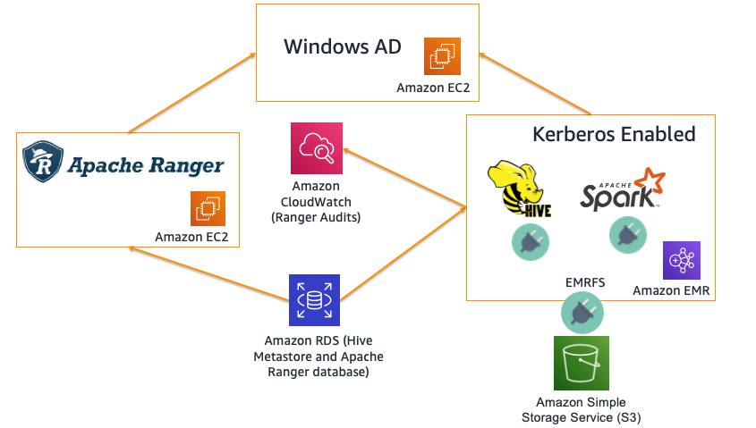

# Authorization and Auditing on Amazon EMR Using Apache Ranger 

The repo contains code tied to the AWS Big Data Blog introducing native Apache Ranger integration with Amazon EMR
The code deploys the following:

- Apache Ranger 2.0
- Windows AD server on EC2
- RDS MySQL database for Apache Ranger and Hive Metastore
- Kerberos Enabled Amazon EMR cluster AWS Managed Ranger Plugins
     * Amazon S3
     * Apache Spark
     * Apache Hive

> **NOTE:** the code only run under US-EAST1. If you need to run in a different region you will need to copy it into a regional bucket. 
>

### NOTE: Apache Ranger plugins and Apache Ranger Admin Server SSL Keys and Certs have to be uploaded to AWS Secrets Manager for these Cloudformation scripts to work

## Cloudformation Launch Steps:

 1. Use this script to Upload SSL key and certs to AWS Secrets Manager [Script](../aws_emr_blog_v3/scripts/emr-tls/create-tls-certs.sh) 
 
 2. Create VPC/AD server (takes ~10 min to run) 
 
 3. Verify DHCPOptions ([link](https://docs.aws.amazon.com/vpc/latest/userguide/VPC_DHCP_Options.html)) to make sure Domain Name servers for the VPC ([link](https://console.aws.amazon.com/vpc/home?region=us-east-1#vpcs:)) are listed in the right order (AD server first followed by AmazonProvidedDNS) 
 
 4. Setup the Ranger Server/RDS Instance/EMR Cluster (takes ~15 min to run)  

## Architecture

## Cloudformation stack output

